# 목차
1.[컨셉](#컨셉)  
2.[관련이미지 & 동영상](#관련이미지-&-동영상)  
3.[대표이미지](#대표이미지)  
4.[컨셉 & 대표이미지 기반 작품묘사](#컨셉-&-대표이미지-기반-작품묘사)  
5.[<아케이드룸> 구성 요소](#<아케이드룸>-구성-요소)  
6.[게임시스템 디자인](#게임시스템-디자인)  
 - [a.게임 오브젝트 분해](#1.게임-오브젝트-분해)
 - [b.피라미터 뽑아보기](#2.피라미터-뽑아-보기)
 - [c.행동 뽑아 보기](#3.행동-뽑아-보기)
 - [d.상태 뽑아 보기](#4.상태-뽑아-보기)
 - [e.플레이어 케릭터 속성](#5.플레이어-케릭터-속성)
 - [f.게임의 규칙](#6.게임의-규칙)   

7.[요구사항 & 흐름도](#<아케이드룸>-요구사항)  

# [컨셉] 

## 메인 컨셉 : 보드게임
 - 보드게임처럼 일정한 룰을 가지고 해결하는 방식

### 서브1 : 스토리
 - 게임을 풀어나가는 것에 대해 지루하지않게 스토리를 적용

### 서브2 : 퍼즐
 - 퍼즐같은 미니게임 요소를 중간중간에 넣어 지루하지 않게 해줌

### 서브3 : 인디게임
 - 예전 인디게임들을 오마주하여 레트로 감성을 살림

### 서브4 : 도트
 - 게임의 이미지등 모든것을 도트그래픽을 사용함

### 서브5 : 보상 & 패널티
 - 퍼즐같은 미니게임을 통해 게임클리어에 도움이되는 보상을 주거나, 실패시 클리어에 방해되는 패널티를 줌

---

  
# [관련이미지 & 동영상]
 - 이미지  
  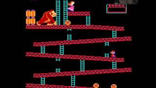
  

---
  
# [대표이미지]
[그림]

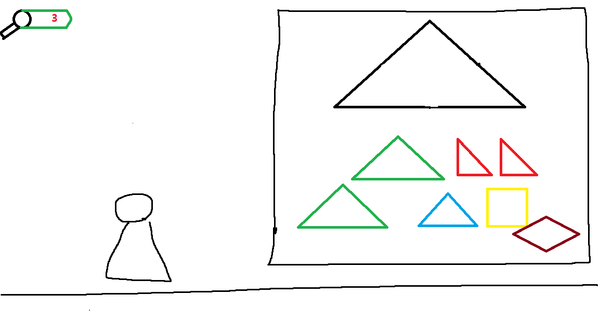

  
# [컨셉 & 대표이미지 기반 작품묘사]
> ### 대표이미지 기반 :
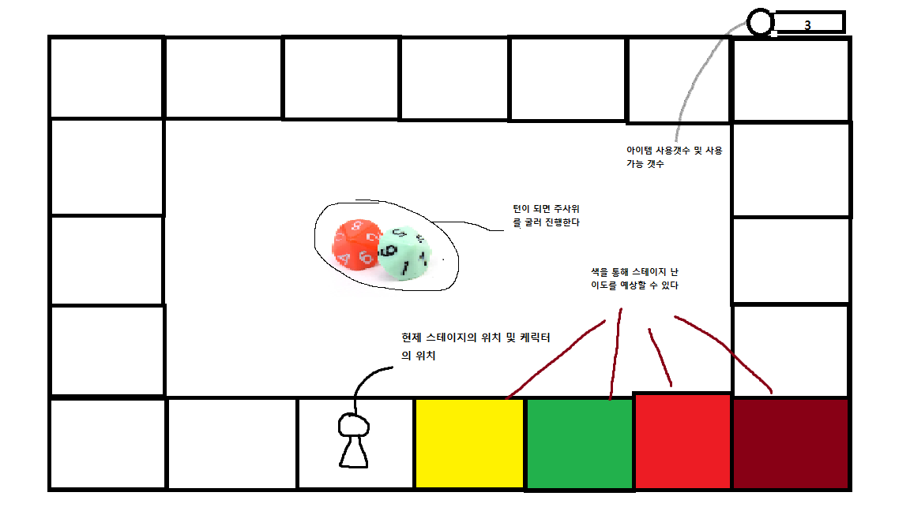
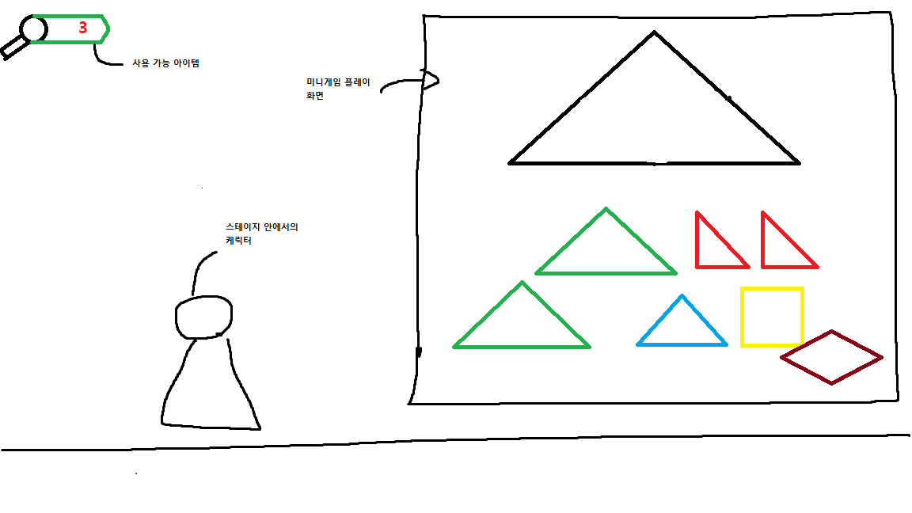

  
# [<아케이드룸> 구성 요소]

 

## 1. 메커니즘

[도전 과제]
1) 도착(클리어)지점까지 무사히 완주를 끝내라
2) 중간중간 미니게임을 통하여 클리어를 더욱 쉽게하자

[재미 요소]
1) 주사위로 나온 맵마다 다른 스테이지를 구성하여 다양하게 클리어 할 수 있다.
2) 미니게임을 통해 또 다른 재미를 느낄 수 있다.
3) 때로는 미니게임을 클리어하지 않을 시 패널티가 적용되어 난이도를 높준다.

 

## 2. 이야기

[만들게 된 배경]  
예전에 재밌게 오락실에서 하던 게임들이 잊혀져 가는거같아 그런 게임들을 한대 모아서 추억을 다시 상기할 수 있게 되길 바래서 만들게 되었습니다.

[스토리]
게임을 좋아하던 주인공은 어느날 게임판위에 있는 자기자신을 발견합니다. 주인공은 탈출을 하기위해 게임판의 룰을 따르게된다. 그로인해 잊혀져 갔던 오락실게임, 옛날 인디게임등을 플레이하면서 점점 성장해 나가게된다.

[카메라 관점]  
주사위를 굴리는 창에서는 3인칭 자유시점에서 보게 하고  
스테이지에 들어갔을 때는 2D 횡스크롤 게임으로 구성할 것 입니다.

 

## 3. 미적요소

[사운드]
스테이지 마다 배경이 되는 게임의 사운드를 가져와 익숙하고 다시한번 예전을 추억해볼 수 있게 했습니다.  

[그레픽]  
도트 디자인을 활용해서 레트로 감성을 추가할 것 이며 응용하는 게임들의 특징들을 최대한 살릴것 입니다.
	
 

# [게임시스템 디자인]  

 

## 1.게임 오브젝트 분해
| 연번 | 오브젝트 이름 | 오브젝트 이미지 |
|:---------: |:------------:|:--------:|
| 1 | 주사위 | 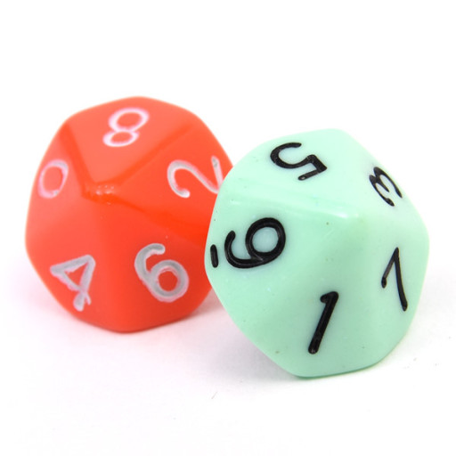 |
| 2 | 보드판 | 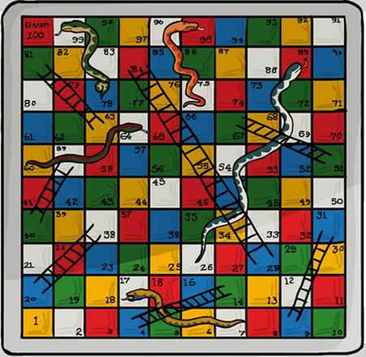 |
| 3 | 마리오 | 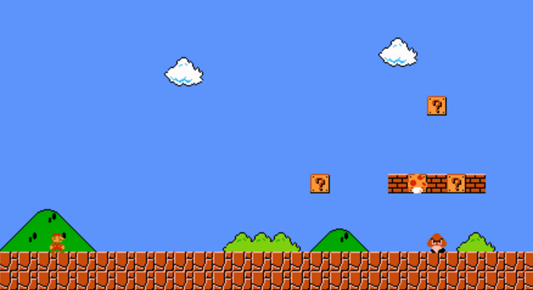 |
| 4   | 동키콩 |  |
| 4-1 | 방해물1 | 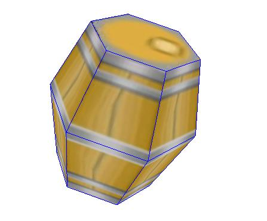 |
| 4-2 | 방해물2 | 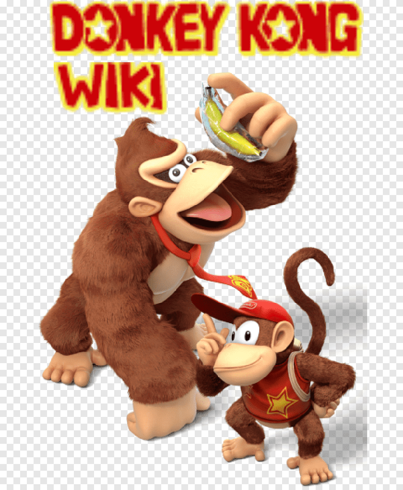 |
| 4-3 | 맵 | 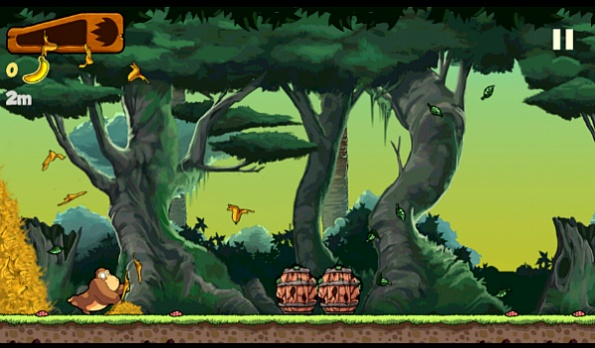 |
| 4-4 | 과일 | 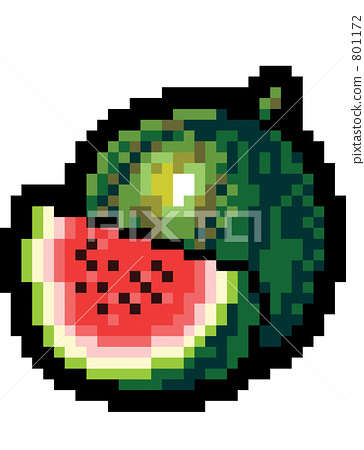 |
| 5 | 스노우브라더스 |  |
| 5-1 | 케릭터 |  |
| 5-2 | 방해물 | 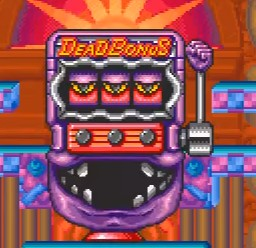 |
| 6 | 페르시안의 왕자 | 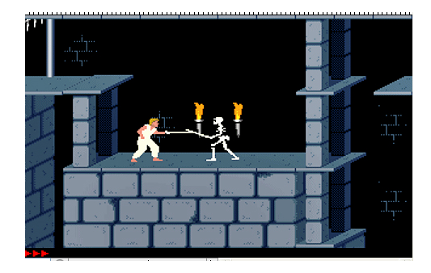 |
| 7 | 펩시맨 | 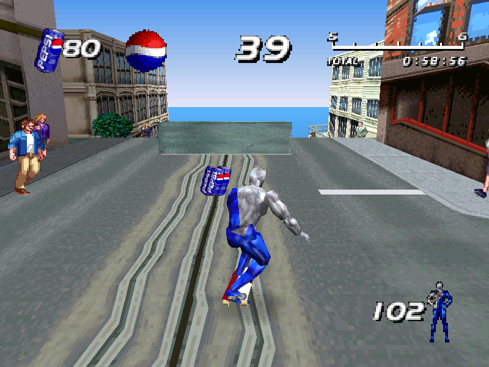 |
| 7-1 | 방해물 | 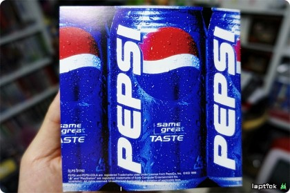 |

 

## 2.피라미터 뽑아보기

1)오브젝트 이름 : 플레이어(케릭터)

| 속성 | 속성 값 | 설명 | 비고 |
|:---:|:---:|:---:|:---:|:---:|
| 이동속도 | 10 | 케릭터가 움직이는 속도 | 난이도 상승시 2up |
| 데미지 | 10 | 방해물및 몬스터에게 주는 데미지 | 일정 아이템 획득시 2up |
| 공격범위 | 5 | 공격을 가할수 있는 거리 | 일정 아이템 획득시 2up |  

2)오브젝트 이름 : 방해물(술통, 펩시캔)

| 속성 | 속성 값 | 설명 | 비고 |
|:---:|:---:|:---:|:---:|:---:|
| 이동속도 | 8 | 방해물이 굴러가는 속도 | 난이도 상승시 2up |

3)오브젝트 이름 : 방해물(몬스터)

| 속성 | 속성 값 | 설명 | 비고 |
|:---:|:---:|:---:|:---:|:---:|
| 이동속도 | 8 | 몬스터가 움직이는 속도 | 난이도 상승시 2up |
| 공격범위 | 5 | 공격을 가할수 있는 거리 | 난이도 상승시 2up |  

 

## 3.행동 뽑아 보기

1)오브젝트 이름 : 플레이어(케릭터)

| 속성 | 설명 |
|:---:|:---:|
| 이동 | 맵에서의 이동 |
| 공격 | 몬스터 및 무언가를 깨기 위한 행동 |  
| 점프 | 어딘가를 올라가거나 방해물을 피하기 위한 행동 |  
| 죽음 | 방해물에 당했을떄 나오는 행동 |  

2)오브젝트 이름 : 방해물(술통, 펩시캔)

| 속성 | 설명 |
|:---:|:---:|
| 이동 | 맵에서의 이동 |
| 낙하 | 방해물이 떨어지는 것 |  
| 파괴 | 다른 오브젝트에 닿아서 없어지는 것 |  

  
3)오브젝트 이름 : 방해물(몬스터)

| 속성 | 설명 |
|:---:|:---:|
| 이동 | 맵에서의 이동 |
| 공격 | 플레이어를 향해 데미지를 주는 행동 |  
| 파괴 | 플레이어의 공격을 받아 없어지는 것 | 

3)오브젝트 이름 : 주사위

| 속성 | 설명 |
|:---:|:---:|
| 굴리기 | 주사위를 굴려 숫자를 나타낸다 |

4)오브젝트 이름 : 보드게임(케릭터)

| 속성 | 설명 |
|:---:|:---:|
| 이동 | 주사위 눈만큼 움직여 스테이지로 들어간다 |

 

## 4.상태 뽑아 보기

1)오브젝트 이름 : 플레이어(케릭터)

| 현상태 | 전의 상태 | 전의 조건 | 
|:---:|:---:|:---:|:---:|
| 기본 | 이동 | 플레이어가 이동키를 눌렀을 때 | 
| 기본 | 점프 | 플레이어가 점프키를 눌렀을 때 | 
| 기본 | 공격 | 플레이어가 공격키를 눌렀을 때 |   
| 기본 | 죽음 | 플레이어가 방해물에 닿았을 때 |   

2)오브젝트 이름 : 방해물(술통, 펩시캔)

| 현상태 | 전의 상태 | 전의 조건 | 
|:---:|:---:|:---:|:---:|
| 기본 | 이동 | 맵에 플레이어가 나타나서 일정거리를 이동 할 때  | 
| 기본 | 낙하 | 떨어지는 지점을 만났을 떄 | 
| 기본 | 파괴 | 방해물이 오브젝트에 닿았을 때 |   

3)오브젝트 이름 : 방해물(몬스터)

| 현상태 | 전의 상태 | 전의 조건 | 
|:---:|:---:|:---:|:---:|
| 기본 | 이동 | 맵에 플레이어가 나타나서 일정거리를 이동 할 때  | 
| 기본 | 공격 | 플레이어가 사정거리 안에 들었을 때 | 
| 기본 | 파괴 | 방해물이 플레이어한태 공격 당했 때 |   

3)오브젝트 이름 : 주사위

| 현상태 | 전의 상태 | 전의 조건 | 
|:---:|:---:|:---:|:---:|
| 기본 | 굴리기 | 주사위를 마우스 클릭하였을 때 |   

3)오브젝트 이름 : 보드게임(케릭터)

| 현상태 | 전의 상태 | 전의 조건 | 
|:---:|:---:|:---:|:---:|
| 기본 | 이동 | 주사위눈의 숫자만큼 이동할 때 | 

 

## 5.플레이어 케릭터 속성

| 속성 | 영문 명칭 | 설명 | 비고 |
|:---:|:---:|:---:|:---:|:---:|
| 이동속도 | Spead | 케릭터가 움직이는 속도 |  |
| 데미지 | Damage | 방해물및 몬스터에게 주는 데미지 |  |

 

## 6.게임의 규칙

[핵심 규칙]   

1) 각각 들어가게 되는 스테이지를 클리어한다.  
2) 보드게임판을 클리어한다.  

[보조 규칙]

1)플레이어가 방해물에 닿을시 목숨이 소진된다.  
2)목숨이 모두 소진시에 게임오버가 된다.  
3)보드게임판의 최종에 다가갈 수록 각 스테이지 난이도가 올라간다.  

# [<아케이드룸> 요구사항]

1) 시작화면, 보드게임화면, 게임화면, 미니게임화면 총 4개의 화면이 있다  
2) 시작화면에는 [새 게임], [이어하기], [설정] 총 3개의 버튼이있다.  
3) [새 게임] 클릭시 [난이도 조절]을 할 수 있는 창이 뜬다  
3-1) [난이도 조절]에는 [쉬움], [보통], [어려움]창이 뜬다  
3-2) 3개의 난이도중 하나를 선택하면 새 게임을 시작한다.  
4) [이어하기] 클릭시 이전에 하던 게임을 이어할 수 있고, 최대 2개까지 저장하여 이어할 수 있다.  
5) [설정] 클릭시 음향조절을 할 수 있다  
6) 시작화면에서 [새 게임] 또는 [이어하기] 를 클릭하고 게임에 들어가면 보드게임화면으로 변경된다  
7) 보드게임화면에서는 현재의 자기 위치, 위험게이지를 볼 수 있고 [주사위], [아이템 사용]버튼이 있다.  
8) 일정 조건이 충족되면 [주사위] 버튼을 눌러 게임을 진행할 수 있다.  
9) [아이템 사용]을 누르면 보드게임화면에서 사용할 수 있는 아이템종류가 창에 뜨며, 때에 따라 사용할 수 있다.  
10) 보드게임화면에서 자기 케릭터를 누르면 해당 게임화면으로 변경이된다.  
11) 게임화면으로 변경시에 동키콩, 마리오, 펩시맨, 스노우브라더스, 페르시안의 왕자 중 한개의 게임으로 참여된다.  
12) 모든게임에 공통적으로 왼쪽상단에 아이템 버튼이있고, 오른쪽 상단에는 목숨을 볼 수 있고, 오른쪽 하단에는 [나가기]버튼이 있다.  
13) 아이템 버튼 클릭시 게임 화면에서 사용할 수 있는 아이템종류가 창에 뜨며, 때에 따라 사용할 수 있다.  
14) 보드게임 칸마다 스테이지가 다르며, 그 스테이지 또한 1-1, 1-2등 최대 7스테이지까지 있다.  
15) 게임화면에서는 2D횡 스크롤 이며 조작은 방향키로 상하좌우를 움직이며, 스페이스바로 점프를 할 수 있다.  
16) 매 스테이지마다 숨겨져 있거나 전진하기위해 미니게임을 수행하게된다.  
17) 미니게임은 팩맨, 테트리스등을 플레이하며 높은 스테이지 일수록 높은 난이도의 미니게임이 나온다.  
18) 팩맨의 기본플레이는 방향키로 플레이하며, 스테이지가 높아 질때마다 유령의 속도가 증가한다.  
19) 테트리스의 기본플레이는 방향키로 블록을 움직이며, 블록의 회전은 스페이스바로 시계방향회전으로만 이루어진다. 
그리고 스테이지가 높아 질때마다 블록의 하강속도가 증가한다.  
20) 테트리스 미니게임의 클리어 조건은 시간버티기, n줄 제거, 무작위 모양에서 줄을 모두제거 가 있다.  
21) 미니게임 클리어시 아이템을 획득 할 수있으며, 클리어하지 못할시에는 불이익이 나타난다.  
22) 아이템의 경우 게임화면에서 사용가능한 아이템, 보드게임화면에서 사용가능한 아이템으로 나뉜다.  
23) 게임화면에서 사용가능한 아이템으로는 무적, 미니게임 스킵, 미니게임 탐지, 스테이지 클리어아이템이 있다.  
24) 보드게임화면에서 사용 가능한 아이템은 적 방해, 주사위 다시한번, 스테이지 스킵, 주사위 고정아이템이 있다.  
25) 미니게임을 클리어하지 못할시에는 스테이지 맨처음으로 돌아 가거나, 보드게임화면에 적이 추가되고, 적이 전진 할 수 있게된다.  
26) [나가기]버튼 클릭시 종료 팝업이 뜬다. 종료팝업에는 현제진행 상황을 볼 수 있고, [저장하기], [계속하기]버튼이 나온다.  
27) 게임 클리어조건은 보드게임화면에서 마지막 스테이지를 클리어하면 클리어 된다.  
28) 게임 종료조건은 목숨을 다쓰거나, 보드게임화면의 적이 플레이어 케릭터를 따라잡을 시에 종료가 된다.  

 

# [개발 일정]

