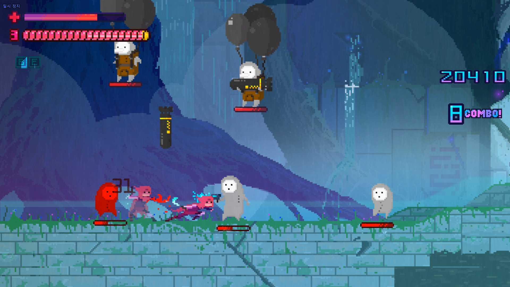

# [컨셉] 

## 메인 컨셉 : 보드게임
 - 보드게임처럼 일정한 룰을 가지고 해결하는 방식

### 서브1 : 스토리
 - 게임을 풀어나가는 것에 대해 지루하지않게 스토리를 적용

### 서브2 : 퍼즐
 - 퍼즐같은 미니게임 요소를 중간중간에 넣어 지루하지 않게 해줌

### 서브3 : 인디게임
 - 예전 인디게임들을 오마주하여 레트로 감성을 살림

### 서브4 : 도트
 - 게임의 이미지등 모든것을 도트그래픽을 사용함

### 서브5 : 보상 & 패널티
 - 퍼즐같은 미니게임을 통해 게임클리어에 도움이되는 보상을 주거나, 실패시 클리어에 방해되는 패널티를 줌

---

  
# [관련이미지 & 동영상]
 - 이미지  
  
  

---
  
# [대표이미지]
[그림]

  
# [컨셉 & 대표이미지 기반 작품묘사]
> ### 대표이미지 기반 :

  
# [<아케이드룸> 구성 요소]

 

## 1. 메커니즘

[도전 과제]
1) 도착(클리어)지점까지 무사히 완주를 끝내라
2) 중간중간 미니게임을 통하여 클리어를 더욱 쉽게하자

[재미 요소]
1) 주사위로 나온 맵마다 다른 스테이지를 구성하여 다양하게 클리어 할 수 있다.
2) 미니게임을 통해 또 다른 재미를 느낄 수 있다.
3) 때로는 미니게임을 클리어하지 않을 시 패널티가 적용되어 난이도를 높준다.

 

## 2. 이야기

[만들게 된 배경]  
예전에 재밌게 오락실에서 하던 게임들이 잊혀져 가는거같아 그런 게임들을 한대 모아서 추억을 다시 상기할 수 있게 되길 바래서 만들게 되었습니다.

[스토리]
게임을 좋아하던 주인공은 어느날 게임판위에 있는 자기자신을 발견합니다. 주인공은 탈출을 하기위해 게임판의 룰을 따르게된다. 그로인해 잊혀져 갔던 오락실게임, 옛날 인디게임등을 플레이하면서 점점 성장해 나가게된다.

[카메라 관점]  
주사위를 굴리는 창에서는 3인칭 자유시점에서 보게 하고  
스테이지에 들어갔을 때는 2D 횡스크롤 게임으로 구성할 것 입니다.

 

## 3. 미적요소

[사운드]
스테이지 마다 배경이 되는 게임의 사운드를 가져와 익숙하고 다시한번 예전을 추억해볼 수 있게 했습니다.  

[그레픽]  
도트 디자인을 활용해서 레트로 감성을 추가할 것 이며 응용하는 게임들의 특징들을 최대한 살릴것 입니다.
